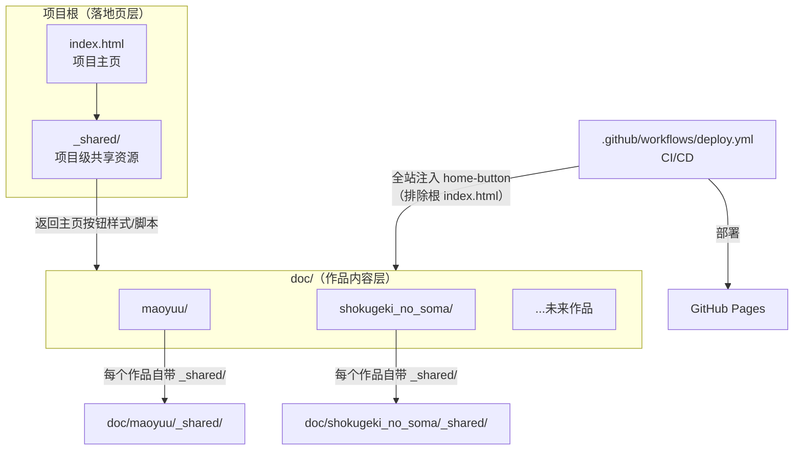
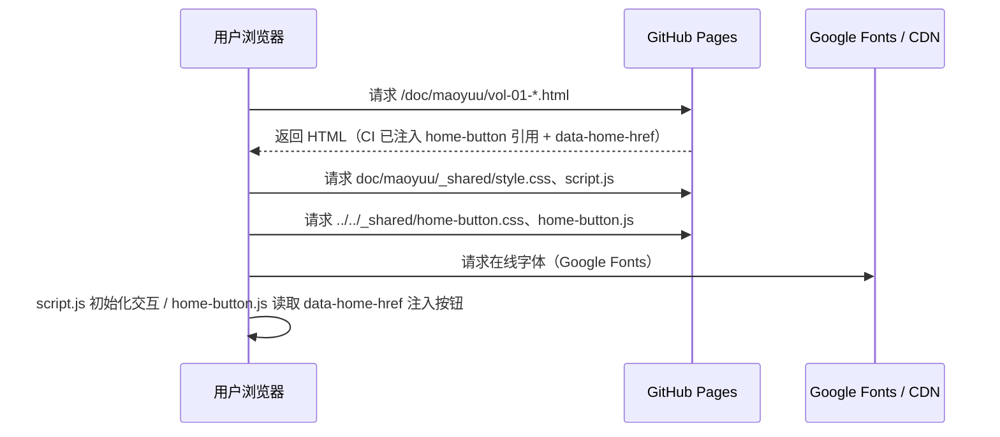
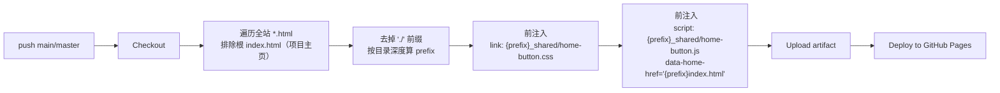
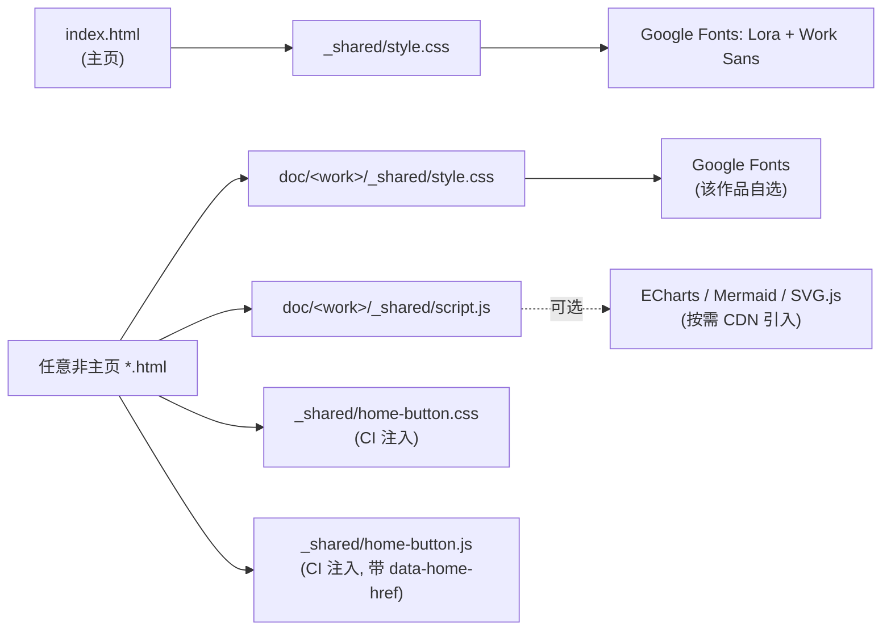
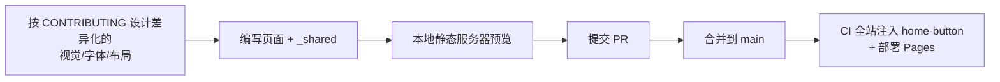

# ARCHITECTURE.md — 项目架构文档

> 本文档面向开发者与项目维护者，系统性说明 **ACG 知识手册库** 的整体架构、模块职责、关键函数、依赖关系与运行方式。
> 若你只想浏览内容，请直接访问 [项目主页](https://wudioql.github.io/Knowledge-based_ACG_works/) 或阅读 [README.md](./README.md)。
> 贡献与开发规范见 [CONTRIBUTING.md](./CONTRIBUTING.md)。

> ⚠️ **部署状态说明**：本文档描述的是 `acg-knowledge-handbook` 分支。该分支**尚未部署**——线上站点（`wudioql.github.io/Knowledge-based_ACG_works/`）由 `main` 分支构建，结构与本文档不同（main 用 `content/` 目录）。因此本文档中的 `doc/` 结构与 [§9](#9-现状与改进方向) 所述现状，均为本分支代码层的状态，部署本分支后才会生效。

---

## 目录

1. [架构总览](#1-架构总览)
2. [技术选型与设计原则](#2-技术选型与设计原则)
3. [目录结构](#3-目录结构)
4. [主要模块职责](#4-主要模块职责)
5. [构建与部署流程](#5-构建与部署流程)
6. [关键类与函数说明](#6-关键类与函数说明)
7. [依赖关系](#7-依赖关系)
8. [项目运行方式](#8-项目运行方式)
9. [现状与改进方向](#9-现状与改进方向)

---

## 1. 架构总览

本项目是一个**纯静态多页站点**（MPA），无前端框架、无构建工具、无后端。运行时架构分为两个清晰的层次：



> 项目文档（`README.md` / `ARCHITECTURE.md` / `CONTRIBUTING.md`）作为根目录静态 Markdown，不参与运行时渲染，因此未画入上图。

### 请求与渲染流程



**核心特点：**

- **零运行时依赖、无需本地构建工具链**：源码即可直接浏览。唯一的构建动作是 CI 在部署期注入返回主页按钮（见 [§5](#5-构建与部署流程)），故本地直接打开作品页时该按钮不会出现（不影响内容阅读）。
- **两层运行架构**：落地页层（根 `index.html`）与作品内容层（`doc/`）各司其职；项目文档（`README` / `ARCHITECTURE` / `CONTRIBUTING`）作为根目录静态 Markdown，不参与运行时。
- **双共享层**：项目级 `_shared/`（返回主页按钮等跨作品通用功能）+ 作品级 `doc/<work>/_shared/`（作品专属样式与脚本）。
- **全站自动注入**：返回主页按钮由 CI 在部署阶段自动注入到**项目主页以外的所有 HTML**，不限目录、无需作品侧操心。

---

## 2. 技术选型与设计原则

| 维度 | 选型 | 理由 |
|------|------|------|
| 渲染模型 | 原生 HTML 多页（MPA） | 每个章节独立成页，利于 SEO、分享、增量更新 |
| 样式 | CSS3 + CSS 自定义属性 | 无预处理器，保存即生效，十年后仍可维护 |
| 脚本 | Vanilla JavaScript（IIFE） | 无框架、无运行时依赖，避免供应链与升级负担 |
| 字体 | Google Fonts 在线 `@import` | 不引入本地字体文件，仓库零体积负担，每作独立选型 |
| 可视化 | ECharts / Mermaid / SVG.js（均在线 CDN） | 数据图、关系图、矢量图各司其职，按需引入 |
| 依赖管理 | 无（npm / 打包器 / 框架） | 零运行时依赖；所有第三方 JS 均运行时 CDN 引入 |
| 构建 | CI 轻量注入（无本地构建工具链） | 唯一构建动作：部署期注入返回主页按钮（见 [§5](#5-构建与部署流程)） |
| 部署 | GitHub Actions → GitHub Pages | 推送即部署，构建期完成 home-button 注入 |

**四条设计原则：**

1. **零依赖优先**：能用原生实现的绝不引入库；可视化库仅在确实提升信息表达时引入。
2. **一作一貌**：每部作品的视觉与结构相互独立，**禁止复制骨架换皮**（详见 CONTRIBUTING）。
3. **共享最小化**：项目级共享只放真正跨作品通用且无需作品自定义的功能（目前仅「返回主页按钮」）。
4. **内容可拆**：按章节/卷/篇章拆分文件，控制单文件体量。

---

## 3. 目录结构

```
.
├── index.html                       # 项目主页（落地页，CI 不向其注入按钮）
├── .nojekyll                        # 禁用 Jekyll 处理（GitHub Pages 配置）
├── .gitignore
├── README.md                        # 项目概览（面向所有人）
├── ARCHITECTURE.md                  # 架构文档（本文档）
├── CONTRIBUTING.md                  # 贡献与开发规范
├── _shared/                         # 【项目级共享层】跨作品通用资源
│   ├── style.css                    #   主页样式表（落地页专用）
│   ├── home-button.css              #   返回主页按钮样式
│   └── home-button.js               #   返回主页按钮注入脚本（运行时注入 DOM）
├── doc/                             # 【作品内容层】所有作品手册
│   ├── maoyuu/                      #   魔王勇者（政治经济学手册）
│   │   ├── index.html               #     作品首页
│   │   ├── glossary.html            #     术语表
│   │   ├── references.html          #     参考文献
│   │   ├── vol-01-agricultural-revolution.html
│   │   ├── ...                      #     各卷内容页（vol-01 ~ vol-08）
│   │   └── _shared/                 #     【作品级共享层】
│   │       ├── style.css            #       作品专属样式
│   │       └── script.js            #       作品交互脚本
│   └── shokugeki_no_soma/           #   食戟之灵（料理全鉴）
│       ├── index.html
│       ├── arc-01-enrollment.html
│       ├── ...                      #     各篇章内容页（arc-01 ~ arc-10)
│       └── _shared/
│           ├── style.css
│           └── script.js
└── .github/workflows/
    └── deploy.yml                   # CI/CD：全站注入 home-button + 部署 Pages
```

### 双 `_shared` 的区别（重要）

| | 项目级 `_shared/`（根目录） | 作品级 `doc/<work>/_shared/` |
|---|---|---|
| 作用域 | 全站所有非首页页面 | 仅该作品自身 |
| 内容 | `home-button.css/js`（返回主页按钮）、`style.css`（主页样式） | 作品专属 `style.css`、`script.js`、可选 `assets/` |
| 谁引用 | 由 CI 注入到全站 HTML；主页 `index.html` 引用 `style.css` | 该作品所有 HTML 通过相对路径引用 |
| 可定制性 | 全站统一，作品**不应**覆盖 | 完全独立，由该作品自行设计 |

---

## 4. 主要模块职责

### 4.1 项目主页 `index.html`

- 站点落地页，展示所有作品手册的入口卡片。
- 包含 Hero 区（项目简介 + 统计数据：作品数 / 知识点数 / 学科领域数）与 About 区。
- 引用 `_shared/style.css` 作为唯一样式来源；**不引入任何 JS**。
- **不注入返回主页按钮**——它本身就是主页，CI 会显式跳过它（见 [§5](#5-构建与部署流程)）。

### 4.2 项目级共享层 `_shared/`

| 文件 | 职责 |
|------|------|
| `style.css` | 主页专用样式：CSS 变量（配色、字体、间距）、Header / Hero / Works Card / Footer 等组件、学科标签配色类 |
| `home-button.css` | 固定在右下角的圆形「返回主页」按钮样式（含 hover 标签、响应式适配） |
| `home-button.js` | 运行时脚本：读取 CI 注入的 `data-home-href`，创建按钮 `<a>` 挂载到 `body`。含防重复渲染保护 |

> 返回主页按钮的 `css/js` 由 CI 在部署阶段以 `<link>` / `<script>` 形式注入到**全站每个非主页 HTML** 的 `</head>` 与 `</body>` 之前（详见 [§5](#5-构建与部署流程)）。

### 4.3 作品内容层 `doc/<work-id>/`

每个作品是一个**自包含子站**，结构相互独立：

| 文件 | 职责 |
|------|------|
| `index.html` | 作品首页：概览、卷/篇章导航、统计、理论分类等（也会被注入返回主页按钮） |
| `vol-XX-*.html` / `arc-XX-*.html` | 内容页：按 [内容拆分政策](./CONTRIBUTING.md#内容拆分政策) 组织，含上一页/下一页导航 |
| `glossary.html` / `references.html` | 辅助页（可选）：术语表、参考文献 |
| `_shared/style.css` | 作品专属样式（**完全独立编写**，配色/字体/布局自主） |
| `_shared/script.js` | 作品交互脚本（**完全独立编写**，IIFE 封装） |
| `_shared/assets/` | 作品资源（SVG / 图片等，可选） |

### 4.4 项目文档（根目录）

- `README.md`：项目概览与设计哲学（面向所有人）。
- `ARCHITECTURE.md`：架构、模块职责、关键函数、依赖、运行方式（本文档）。
- `CONTRIBUTING.md`：贡献流程、视觉差异化、字体 / 拆分 / 可视化等政策。

> 这三者均为根目录静态 Markdown，不参与站点运行时。此外，项目在 GitHub 上设有独立的 **Wiki**（独立 git 仓库），承载方法论、教程与资源等长青内容。

### 4.5 CI/CD `.github/workflows/deploy.yml`

- 触发：push 到 `main` / `master`，或手动 `workflow_dispatch`。
- 职责：Checkout → 全站遍历 HTML 注入 home-button → 上传 artifact → 部署 GitHub Pages。

---

## 5. 构建与部署流程

本项目的「构建」极其轻量，**唯一的构建动作是注入返回主页按钮**。



### 注入范围

注入目标是**项目主页（根 `index.html`）以外的所有 HTML 页面**，**不限定目录**：

- 不仅 `doc/` 下的作品页会被注入，未来任何目录下新增的页面（包括根目录下除 `index.html` 外的其他页面）都会自动得到按钮。
- 唯一被排除的是根目录的 `index.html`（它就是按钮的跳转目标）。

### 注入逻辑（`deploy.yml` 核心片段）

1. `find . -name "*.html" -not -path "*/.*"` 全站扫描（跳过 `.git` 等隐藏目录）。
2. `f="${f#./}"` 去掉 `find` 输出的 `./` 前缀（否则 `dirname` 得到的 `./doc/maoyuu` 会把那个 `.` 误算成一层目录）；`[ "$f" = "index.html" ] && continue` 跳过项目主页。
3. 按文件**所在目录深度**算 `prefix`（回仓库根的 `../` 串）。
4. `sed` 在 `</head>` 前注入 `<link href="{prefix}_shared/home-button.css">`。
5. `sed` 在 `</body>` 前注入 `<script src="{prefix}_shared/home-button.js" data-home-href="{prefix}index.html">`。

### 设计要点：路径由 CI 构建期算定，而非 JS 运行时推算

跳转目标 `data-home-href` 在**构建期**由 bash 按真实目录深度算定，写进 `<script>` 标签的属性。这样：

- 路径适配任意目录深度（`index.html` / `../index.html` / `../../index.html` / `../../../index.html` 都会出现）。
- JS 只需**读取** `data-home-href`，无需从 `window.location` 或硬编码仓库名推算——bash 按真实目录结构计算，绝对可靠，不依赖浏览器环境。

### 各深度路径对照

| 文件位置 | 注入的 `data-home-href` |
|----------|------------------------|
| `index.html`（项目主页） | 不注入（跳过） |
| `about.html`（根目录其他页） | `index.html` |
| `doc/maoyuu/vol-01.html` | `../../index.html` |
| `doc/maoyuu/index.html`（作品首页） | `../../index.html` |
| `a/b/c/deep.html` | `../../../index.html` |

> 因此，**作品/页面 HTML 源码中无需手动写入 home-button 引用**——按钮的样式、脚本、跳转路径全部由 `_shared` 与 CI 在构建期注入。源码中不包含任何 home-button 引用，保持作品文件干净。

---

## 6. 关键类与函数说明

> 本项目无「类」，仅有函数与 CSS 自定义属性。以下按模块说明关键函数与设计令牌。

### 6.1 项目级 `_shared/home-button.js`

一个立即执行函数（IIFE），**职责单一**：读取 CI 注入的跳转路径，在页面右下角挂载返回主页按钮。

**注入产物（DOM）：**

```html
<a id="home-button" href="../../index.html" title="返回项目主页">
  <span aria-hidden="true">🏠</span>
  <span class="home-label">主页</span>
</a>
```

默认只显示 🏠 图标；"主页"文字作为 hover 标签（`.home-label` 默认 `opacity:0`，鼠标悬停显现，样式见 `home-button.css`）。`href` 取自 `<script data-home-href>`。

**逻辑：**

| 步骤 | 作用 |
|------|------|
| `if (document.getElementById('home-button')) return;` | 防重复渲染：即使页面被注入多次，也只渲染一个按钮 |
| `current.getAttribute('data-home-href')` | 读取 CI 构建期算定的跳转路径（任意深度均已正确）；读不到时回退 `'./index.html'`（防御兜底） |
| 创建 `<a>` 并 `appendChild` 到 `body` | 挂载按钮 |

```javascript
if (document.getElementById('home-button')) return;        // 防重复
var current = document.currentScript;
var home = (current && current.getAttribute('data-home-href')) || './index.html';
btn.href = home;
```

> **设计说明**：跳转路径完全由 CI（bash 按目录深度算定）写入 `data-home-href`，JS 仅读取、不推算。这样把路径计算放在构建期（可静态验证），而非运行时（依赖浏览器环境），使按钮行为在任何目录深度下都正确。

### 6.2 项目级 `_shared/style.css`（落地页样式）

**CSS 设计令牌（`:root`）：**

| 令牌 | 作用 | 示例值 |
|------|------|--------|
| `--bg / --bg2 / --ink / --muted / --rule` | 背景 / 主文 / 次文 / 分隔线配色 | `#FAFAF5 / #1A1A2E / ...` |
| `--accent / --accent2` | 主/次强调色 | `#8B0000 / #B8860B` |
| `--tag-*` | 学科标签色（经济/政治/历史/哲学/料理/日式/法式/分子） | `#1565C0 / #C62828 / ...` |
| `--font-heading / --font-body` | 标题/正文字体 | `'Lora' / 'Work Sans'` |
| `--max-width / --content-width` | 布局宽度 | `1200px / 1080px` |

**主要组件类：** `.site-header` / `.site-nav`（含移动端 `.nav-toggle` 折叠）、`.hero` / `.hero-stats`、`.works-grid` / `.work-card`（含 banner 子类如 `.maoyuu-banner`）、`.section-title`、`.site-footer`。

> 返回主页按钮的样式由独立的 `home-button.css` 负责，不放在 `style.css` 中——主页（`index.html`）不出现按钮，因此 `style.css` 只管主页样式。

### 6.3 作品级 `doc/<work>/_shared/script.js`

各作品的交互脚本，统一以 **IIFE 封装**，在 `DOMContentLoaded` 时按 `initXxx()` 拆分调用。

> ⚠️ **注意**：目前两部作品的 `script.js` 暴露**完全相同**的 6 个函数签名（见 [§9](#9-现状与改进方向)），属于同质化现象。新作品**不应照抄**此函数集，应按内容真实需求裁剪/替换。

| 函数 | 职责 | 依赖的 DOM 结构 |
|------|------|-----------------|
| `initNavToggle()` | 移动端导航折叠（切换 `.open`，同步 `aria-expanded`） | `.nav-toggle` / `.site-nav` |
| `initCollapsibles()` | 折叠区块的展开/收起 | `.collapsible-toggle[aria-controls]` |
| `initFilter()` | 按标签筛选卡片（读 `data-filter`，筛选 `data-discipline`/`data-cuisine`） | `.filter-btn` / `.topic-card`·`.dish-card` |
| `initBackToTop()` | 滚动超过阈值显示返回顶部按钮 | `.back-to-top` |
| `initSideToc()` | 侧边目录随滚动高亮当前章节 | `.side-toc a[href^="#"]` |
| `initSmoothScroll()` | 锚点平滑滚动 | `a[href^="#"]` |

### 6.4 作品级 `doc/<work>/_shared/style.css`

各作品自定义的 `:root` 设计令牌与组件类。配色/字体由作品独立设计。以魔王勇者为例：主色 `--accent: #8B0000`、`--disc-econ/-politics/-history/-tech/-philosophy` 学科色等。

---

## 7. 依赖关系

### 7.1 运行时资源依赖图



### 7.2 依赖清单

| 依赖 | 类型 | 引入方式 | 是否必须 |
|------|------|----------|----------|
| Google Fonts | 在线字体 | CSS `@import` | 每作品自选，必须在线引入 |
| ECharts | 可视化（数据图） | 页面内 `<script>` CDN | 按需，使用数据可视化时 |
| Mermaid | 可视化（关系/流程/时序图） | 页面内 `<script>` CDN | 按需 |
| SVG.js | 可视化（矢量图编程操控） | 页面内 `<script>` CDN | 按需 |
| GitHub Actions | CI | `.github/workflows/deploy.yml` | 部署必须 |

> **零本地依赖**：无 `node_modules`、无构建产物目录。所有第三方 JS 均通过在线 CDN 引入，不在仓库内重新构建或托管本地副本（详见 CONTRIBUTING [可视化规范](./CONTRIBUTING.md#可视化规范)）。

---

## 8. 项目运行方式

### 8.1 本地预览（只读浏览）

```bash
git clone https://github.com/wudioql/Knowledge-based_ACG_works.git
cd Knowledge-based_ACG_works
python3 -m http.server 8080      # 推荐
# 浏览器访问 http://localhost:8080
```

> 用静态服务器而非 `file://` 直接打开，可保证相对路径与字体加载行为与线上一致。
> 返回主页按钮由 CI 注入，本地源码中不含该引用，故本地预览时该按钮**不会出现**——这属于预期行为。

### 8.2 本地完整预览（含返回主页按钮）

如需在本地看到注入后的效果，可手动复刻 CI 的注入逻辑：在任一非主页 HTML 的 `</head>` 前插入 `<link href="{prefix}_shared/home-button.css">`、`</body>` 前插入 `<script src="{prefix}_shared/home-button.js" data-home-href="{prefix}index.html">`（`{prefix}` 按该文件目录深度取，如 `doc/maoyuu/x.html` 用 `../../`）。

或临时将对应页面提交到一个会触发部署的分支，通过 GitHub Pages 预览。

### 8.3 部署（线上）

- **触发**：push 到 `main` / `master`，或 Actions 页手动运行。
- **流程**：见 [§5](#5-构建与部署流程)。
- **产物**：部署到 `https://wudioql.github.io/Knowledge-based_ACG_works/`。
- **前置配置**：仓库 Settings → Pages → Source 设为 GitHub Actions；`.nojekyll` 已存在以禁用 Jekyll。
- ⚠️ 注意：当前 `acg-knowledge-handbook` 分支**未合并到 main**，故线上仍为 main 的结构（`content/`）。本文档描述的 `doc/` 结构需待该分支合并部署后才上线。

### 8.4 开发循环（新增/修改作品）



---

## 9. 现状与改进方向

> 本节描述 `acg-knowledge-handbook` 分支当前的实现现状与后续可改进的方向。详见 [CONTRIBUTING.md — 视觉身份差异化指南](./CONTRIBUTING.md#视觉身份差异化指南)。

### 当前已具备的能力

| 能力 | 说明 |
|------|------|
| 返回主页按钮注入 | CI 全站自动注入，指向项目主页；路径由构建期算定，适配任意目录深度（见 [§5](#5-构建与部署流程)） |
| 在线字体加载 | 各 `style.css` 通过 Google Fonts `@import` 引入，`font-family` 家族名与 Google Fonts 一致（含空格，如 `'Work Sans'`） |
| 内容拆分 | 各内容页按卷/篇章独立成文件，均在 150 KB 内（见 [§4](#4-内容拆分政策)） |

### 待改进方向

| # | 方向 | 当前现状 | 改进方向 |
|---|------|----------|----------|
| 1 | **作品视觉差异化** | 两部作品字体同为 `Lora + Work Sans`；页面骨架同为 `site-header → hero → main → footer`；`script.js` 的 6 个函数完全同名同构 | 按 CONTRIBUTING [视觉身份差异化指南](./CONTRIBUTING.md#视觉身份差异化指南) 逐步分化；新作品必须显著区分 |
| 2 | **知识可视化** | 两部作品尚未使用 ECharts / Mermaid / SVG.js | 按内容需要引入，参见 CONTRIBUTING [可视化规范](./CONTRIBUTING.md#可视化规范) |
| 3 | **大文件关注** | `arc-08-regiment.html` ≈ 89 KB、`arc-09-blue.html` ≈ 73 KB | 未超 150 KB 红线；持续关注，必要时按拆分政策二次切分 |

> 以上为内容与设计层面的演进方向，不影响当前站点功能。
