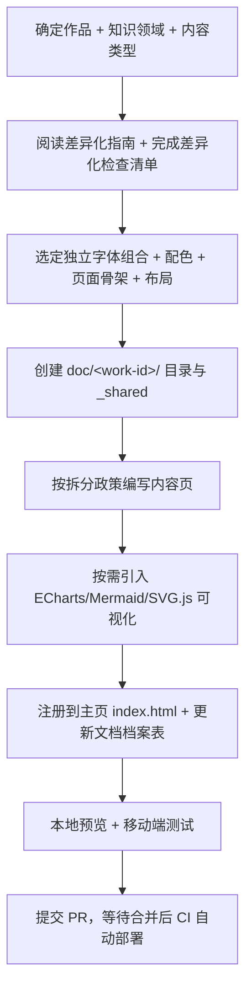
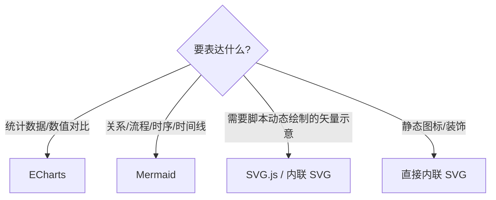

# CONTRIBUTING.md — 贡献与开发规范

> 本文档面向**内容贡献者与开发者**：说明如何为「ACG 知识手册库」新增作品、补充内容、修正错误。
> 若你只想浏览内容，请访问 [项目主页](https://wudioql.github.io/Knowledge-based_ACG_works/) 或阅读 [README.md](README.md)。
> 架构细节见 [ARCHITECTURE.md](ARCHITECTURE.md)。

---

## 目录

1. [贡献流程概览](#1-贡献流程概览)
2. [视觉身份差异化指南（一作一貌）](#2-视觉身份差异化指南一作一貌)
3. [字体政策](#3-字体政策)
4. [内容拆分政策](#4-内容拆分政策)
5. [可视化规范](#5-可视化规范)
6. [开发规范](#6-开发规范)
7. [`_shared` 全局注入说明](#7-_shared-全局注入说明必读)
8. [添加新作品指南](#8-添加新作品指南)
9. [提交规范与 PR 流程](#9-提交规范与-pr-流程)
10. [已有作品视觉档案](#10-已有作品视觉档案)

---

## 1. 贡献流程概览



**贡献类型：**

- **新增作品**：按 [§8](#8-添加新作品指南) 全流程操作。
- **补充现有内容**：在对应作品的 `vol-*.html` / `arc-*.html` 中增补，注意 [§4 文件大小上限](#4-内容拆分政策)。
- **修正错误**：直接改对应文件，提交 PR 并在描述中说明出处依据。

---

## 2. 视觉身份差异化指南（一作一貌）

> 🔴 **本节是项目最重要的约束。**
> 本项目坚持「一作一貌」——每部作品的知识手册都应拥有**独立的视觉个性**，反映原作气质。新作品**严禁**复制已有作品的页面骨架、字体组合、布局或脚本结构后「换皮」。
>
> **当前现状**：现有两部作品（《魔王勇者》《食戟之灵》）在字体、骨架、脚本函数上较为相似。新增作品**不得**延续这一模式，须与之显著区分。

### 2.1 差异化检查清单（开发前**必须**完成）

在动手写代码前，对照下表确认你的设计与**所有已有作品**存在显著差异。**前两项为硬性要求（必须不同），后三项为强约束（鼓励不同，相同需写明充分理由）。**

| # | 维度 | 要求 | 现状参考 |
|---|------|------|----------|
| 1 | **字体组合** | 🔴 必须不同：标题字体与正文字体**至少一项**与所有已有作品不同 | 当前两部均为 `Lora + Work Sans`（需被打破） |
| 2 | **主色（accent）** | 🔴 必须不同：不得与任何已有作品主色相同或肉眼相近，冷暖调须有意识区分 | `#8B0000` 暗红、`#C0392B` 亮红均已被占用 |
| 3 | **页面骨架** | 🟠 强约束：避免无脑沿用 `header → hero → main → footer` | 两部均用此骨架 |
| 4 | **布局模式** | 🟠 强约束：卡片网格已被两部使用，请换其他 | 左/右侧 TOC 卡片网格 |
| 5 | **交互组件集** | 🟡 按需：评估真实需求，不要默认把折叠/筛选/TOC 全实现一遍 | 两部脚本函数完全雷同 |

### 2.2 反模式（禁止）

下列行为**一律拒绝合并**：

- ❌ 直接复制已有作品 `_shared/style.css` 后仅改色值。
- ❌ 套用已有作品 HTML 模板，仅替换文案与图片。
- ❌ 使用与某已有作品**完全相同**的字体组合。
- ❌ 复制粘贴已有作品 `script.js`（即便函数名相同也算违规——每个作品的交互应基于其内容形态重新设计）。
- ❌ 把同一套 `.site-header` / `.hero` / `.section-title` 命名与结构跨作品原样复用。

### 2.3 可选的差异化方向

当不确定如何差异化时，可从以下方向挑选组合（**每个作品至少命中 2 个**）：

**页面骨架替代方案：**

- 无 hero 区，直接进入内容导航
- 全宽 banner 取代 gradient hero
- 侧边栏布局 / 分屏（split-screen）/ 杂志式多栏混排

**布局模式替代方案（按内容类型选）：**

| 内容类型 | 推荐布局 | 适合 |
|----------|----------|------|
| 手册 / 学术 | 双栏对照表、长文阅读式、侧边固定 TOC | 政经、哲思 |
| 全鉴 / 图鉴 | 瀑布流、搜索 + 网格、卡片流 | 料理、装备、角色 |
| 年表 | 垂直时间线、节点式、按年代筛选 | 历史类 |
| 地图 / 地理 | 交互式地图、标注式信息卡 | 世界观类 |
| 对比分析 | 双栏并排、矩阵、雷达图 | 多维度评测 |

**交互替代思路：**

- 时间线类 → 按「年代筛选」而非「学科筛选」
- 图鉴类 → 「搜索 + 网格」而非「标签 + 折叠」
- 叙事类 → 可能根本不需要筛选，专注阅读流

### 2.4 内部一致性原则

差异化是对**作品之间**的要求；**作品内部**则必须保持一致：

- 同一作品内配色、字号、间距、组件结构统一。
- 用该作品自己的 CSS 自定义属性管理设计令牌（命名可自主，不必沿用他作）。

---

## 3. 字体政策

### 3.1 硬性规则

1. **必须使用在线字体**：通过 Google Fonts 的 CSS `@import` 引入，**绝不使用本地字体文件**（不在仓库或作品目录中放 `.woff/.woff2/.ttf/.otf`）。
2. **每部作品字体组合独立**：标题 + 正文字体，至少一项与所有已有作品不同（见 [§2.1](#21-差异化检查清单开发前必须完成)）。
3. **字体须支持中文**：标题字体需有良好中文排版效果；正文可用系统中文字体作 fallback。
4. **每部作品最多 2 款字体**（1 标题 + 1 正文），避免过多字体资源拖慢加载。

### 3.2 引入方式

```css
/* 作品 _shared/style.css 顶部 */
@import url('https://fonts.googleapis.com/css2?family=Noto+Serif+SC:wght@400;700&family=Noto+Sans+SC:wght@400;700&display=swap');

:root {
  --font-heading: 'Noto Serif SC', 'Georgia', serif;
  --font-body: 'Noto Sans SC', 'Helvetica Neue', sans-serif;
}
```

> ⚠️ **避坑**：Google Fonts 家族名含空格时（如 `Work Sans`、`Noto Sans SC`），`@import` 的 URL 中用 `+` 连接，但 `font-family` 声明中**必须保留空格**写作 `'Work Sans'`。家族名必须与 Google Fonts 实际返回的 `font-family` 完全一致，否则字体不会被加载、会回退到系统字体。

### 3.3 按作品气质的字体推荐

> 推荐 Google Fonts 可用字体。中文字体文件较大，优先正文用系统字体 fallback、标题用在线中文字体。

| 气质 | 标题推荐 | 正文推荐 |
|------|----------|----------|
| 学术 / 政治 / 历史 | Noto Serif SC、Source Han Serif | Noto Sans SC、Source Han Sans |
| 料理 / 生活 / 日常 | Playfair Display、Cormorant Garamond | Lato、Mulish |
| 奇幻 / 冒险 / 战斗 | Cinzel、MedievalSharp | Raleway、Quicksand |
| 科幻 / 科技 / 未来 | Orbitron、Rajdhani | Exo 2、Fira Sans |
| 悬疑 / 推理 / 恐怖 | (仅英文部分) Creepster | Merriweather、Crimson Text |

---

## 4. 内容拆分政策

### 4.1 基本原则

内容**必须**按章节 / 卷 / 篇章拆分为独立 HTML 文件，防止单文件过大导致加载缓慢与编辑困难。

### 4.2 文件大小上限

| 资源 | 上限 | 说明 |
|------|------|------|
| 单个 HTML 内容文件 | **≤ 150 KB** | 超出须二次拆分 |
| 单个作品 CSS | **≤ 50 KB** | 作品级样式表 |
| 单个作品 JS | **≤ 20 KB** | 作品级脚本（不含 CDN 库） |

### 4.3 拆分与命名

- **按叙事结构拆分（推荐）**：卷制 `vol-XX-*.html`、篇章制 `arc-XX-*.html`、章节制 `ch-XX-*.html`、话数制按范围分组。
- **辅助页独立**：术语表 `glossary.html`、参考文献 `references.html`、人物关系 `characters.html`、索引入口 `index.html`。
- **命名规范**：小写英文 + 连字符；编号两位前导零（`vol-01`、`arc-01`）；名称用英文简述主题（`vol-01-agricultural-revolution.html`）；**避免中文文件名**（兼容性）。
- **超限二次拆分**：按知识点/条目分组移出独立文件，用交叉引用链接，在索引页提供清晰导航。

### 4.4 导航要求

- 每个内容页必须有「上一章 / 下一章」导航。
- 索引页须提供到所有内容页的链接。
- 内容页间通过交叉引用建立知识网络。

---

## 5. 可视化规范

> 合理运用可视化提升知识表达，但不过度堆砌。三类工具**职责分明、按需引入、一律在线 CDN**——**不在仓库内本地构建或托管其 JS 文件**。

### 5.1 三类可视化库的分工

| 库 | 定位 | 适用场景 | CDN 引入 |
|----|------|----------|----------|
| **ECharts** | 数据可视化（图表） | 统计柱状/折线/饼图、对比雷达图、知识分布热力图 | 在线 CDN（如 jsdelivr / 官方 CDN） |
| **Mermaid** | 文本驱动图表 | 关系图、流程图、时序图、时间线、甘特图 | 在线 CDN |
| **SVG.js** | 矢量图编程操控 | 需脚本动态生成/交互的矢量图示、自定义图解 | 在线 CDN |

> 📌 本项目的可视化库为 **ECharts**（数据图表）、**Mermaid**（关系/流程图）、**SVG.js**（矢量图编程操控）三者。三者均从 CDN 直接引用，不本地构建或托管 JS 文件。

### 5.2 选用决策



- **能用语义化 HTML 表达的不要用图**（如简单 2–3 项列表用 `<ul>`，对比数据用 `<table>`）。
- 需要**精确像素控制**或**静态矢量**：直接内联 SVG（≤ 10 KB / 个）。
- 需要**脚本动态生成/交互**的矢量图：用 SVG.js。
- 需要**数据图表**：用 ECharts。
- 需要**关系/流程**：用 Mermaid。

### 5.3 使用规范

- **统一从在线 CDN 引入**，版本固定，不下载到 `_shared/assets/` 重新构建。
- 每页资源预算：Mermaid 图 ≤ 5 个、内联 SVG ≤ 10 KB / 个；ECharts / Mermaid / SVG.js 这类重型库**单页至多引入 2 种**，评估加载影响。
- 所有图表须有文字替代：`aria-label` 或相邻说明文字。
- 复杂图表在移动端提供折叠 / 展开控制。

### 5.4 引入示例

```html
<!-- ECharts -->
<script src="https://cdn.jsdelivr.net/npm/echarts@5/dist/echarts.min.js"></script>
<!-- Mermaid -->
<script type="module">
  import mermaid from 'https://cdn.jsdelivr.net/npm/mermaid@10/dist/mermaid.esm.min.mjs';
  mermaid.initialize({ startOnLoad: true });
</script>
<!-- SVG.js -->
<script src="https://cdn.jsdelivr.net/npm/svg.js@3/dist/svg.min.js"></script>
```

> 具体版本号以官方最新稳定版为准；固定大版本号避免意外破坏性变更。

---

## 6. 开发规范

### 6.1 文件组织

- 作品目录：**小写英文 + 下划线**（`shokugeki_no_soma`）。
- 共享资源必须放在作品级 `_shared/` 子目录。
- 所有 HTML 使用语义化标签（`header` / `main` / `section` / `article` / `footer`）。
- HTML 头部 `<title>` 建议格式：`页面标题 | 作品名称 | ACG 知识手册库`。

### 6.2 CSS 规范

- 用 CSS 自定义属性（`:root` 变量）管理设计令牌：配色、字体、间距、圆角等。
- **命名不强制统一**：现有作品的 `.site-*` / `.hero-*` / `.vol-*` / `.arc-*` 前缀仅供**参考**，新作品可设计自己的命名体系，但须**作品内部一致**。
- ⚠️ 不要跨作品复用同一套 class 名与结构（违反 [§2](#2-视觉身份差异化指南一作一貌)）。

### 6.3 JavaScript 规范

- 每个作品 `script.js` 用 **IIFE 封装**，避免全局污染。
- 功能按 `initXxx()` 拆分，`DOMContentLoaded` 时统一调用。
- 优先原生 DOM API；事件委托优于逐元素绑定。
- ⚠️ **不要复制已有作品脚本**：按本作品内容形态重新设计所需交互（现有两部作品脚本雷同，新作品应避免延续这一模式）。

---

## 7. `_shared` 全局注入说明（必读）

> **关键结论：作品手册编写时，完全无需关心「返回主页」按钮。**

- 项目根 `_shared/` 提供 `home-button.css` 与 `home-button.js`。
- **CI（`.github/workflows/deploy.yml`）在部署阶段自动**把它们以 `<link>` / `<script>` 注入到**项目主页以外的所有 HTML** 的 `</head>` / `</body>` 之前，并按目录深度计算正确的相对路径。
- 项目主页（根 `index.html`）不会被注入（它本身就是返回目标）。

**因此：**

- ✅ 在作品 HTML 中**不要**手动写入 `home-button.css` / `home-button.js` 的引用。
- ✅ 把返回按钮的样式与行为完全交给 `_shared` 与 CI。
- ❌ 手动写入会与 CI 注入**重复**。源码中不包含任何 home-button 引用，统一由 CI 在部署时注入。

按钮的跳转路径由 CI 在构建期算定并写入 `<script data-home-href>`，运行时由 `home-button.js` 读取（详见 [ARCHITECTURE.md §6.1](ARCHITECTURE.md#61-项目级-_sharedhome-buttonjs)）。

---

## 8. 添加新作品指南

### 前置检查

- [ ] 已确定作品名、知识领域、内容类型（手册 / 全鉴 / 年表 / 地图）
- [ ] 已阅读 [§2 差异化指南](#2-视觉身份差异化指南一作一貌) 并完成 [差异化检查清单](#21-差异化检查清单开发前必须完成)
- [ ] 已确认字体组合、主色、骨架、布局均与已有作品显著不同

### Step 1 — 创建目录结构

```
doc/<work-id>/
├── index.html              # 作品首页
├── _shared/
│   ├── style.css           # 作品样式（独立编写）
│   ├── script.js           # 作品脚本（独立编写）
│   └── assets/             # 作品资源（可选）
└── <内容页>.html            # 按拆分政策创建
```

### Step 2 — 选择字体（[§3](#3-字体政策)）

- [ ] 按作品气质选择，确认与已有作品不同
- [ ] `@import` 引入 Google Fonts，定义 `--font-heading` / `--font-body`
- [ ] 家族名含空格的字体在 `font-family` 中**保留空格**

### Step 3 — 设计配色（[§2.1](#21-差异化检查清单开发前必须完成)）

- [ ] 主色与所有已有作品不同，冷暖调有意区分
- [ ] 用 CSS 变量定义完整色板（可用 [coolors.co](https://coolors.co)）

### Step 4 — 设计骨架与布局（[§2](#2-视觉身份差异化指南一作一貌)）

- [ ] 页面骨架、布局模式与已有作品不同（至少命中 [§2.3](#23-可选的差异化方向) 中 2 个方向）
- [ ] 按内容真实需求裁剪交互组件，**不复制他作脚本**

### Step 5 — 编写内容（[§4](#4-内容拆分政策)）

- [ ] 按章节/卷/篇章拆分为独立 HTML
- [ ] 每文件 ≤ 150 KB
- [ ] 每页含上一页/下一页导航

### Step 6 — 引入可视化（[§5](#5-可视化规范)，按需）

- [ ] 在确实提升表达处引入 ECharts / Mermaid / SVG.js（在线 CDN）
- [ ] 为图表添加文字替代

### Step 7 — 创建作品首页

- [ ] 展示作品概览与统计
- [ ] 提供到所有内容页的导航

### Step 8 — 注册到项目主页

- [ ] 在根 `index.html` 的 `.works-grid` 添加作品卡片（含 banner 样式）
- [ ] 更新 README.md 的「作品总览」表
- [ ] 更新本文档 [§10 已有作品视觉档案](#10-已有作品视觉档案)

### Step 9 — 测试与部署

- [ ] 本地静态服务器预览，所有页面正常
- [ ] 移动端响应式检查
- [ ] 所有链接有效
- [ ] 提交 PR → 合并后 CI 自动注入 home-button 并部署

---

## 9. 提交规范与 PR 流程

### 分支与提交

- 在 `acg-knowledge-handbook` 分支或特性分支开发，PR 合并到主部署分支。
- Commit 信息建议：`feat: 新增《XXX》知识手册` / `docs: 完善架构文档` / `fix: 修正 XXX 字体引用`。

### PR 描述模板

```markdown
## 变更类型
- [ ] 新增作品  [ ] 补充内容  [ ] 修正错误  [ ] 文档

## 差异化自检（新增作品必填）
- 字体组合：<标题> + <正文>（与已有作品不同：是/否）
- 主色：#xxxxxx（不同：是/否）
- 骨架/布局：<描述>（差异化说明）

## 内容自检
- [ ] 每文件 ≤ 150 KB
- [ ] 未手动写入 home-button 引用
- [ ] 可视化库在线 CDN 引入
```

---

## 10. 已有作品视觉档案

> 新作品添加后请登记其视觉指纹；新增前请对照此表确保差异化。

| 作品 | 标题字体 | 正文字体 | 主色 | 色调 | 页面骨架 | 布局 | 交互 |
|------|----------|----------|------|------|----------|------|------|
| 魔王勇者 | Lora | Work Sans | `#8B0000` | 冷学术 | header→hero→main→footer | 卡片网格 + 左侧 TOC | 筛选/折叠/TOC/返回顶部 |
| 食戟之灵 | Lora | Work Sans | `#C0392B` | 暖料理 | header→hero→main→footer | 卡片网格 + 右侧 TOC | 筛选/折叠/TOC/返回顶部 |

> 🔴 上表可见两部作品在字体、骨架、交互上**高度同质**。新作品**必须**打破这一模式：字体组合与主色须不同，骨架/布局/交互鼓励不同。
