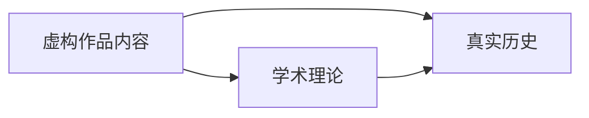

# ACG 知识手册库

[](https://github.com/wudioql/Knowledge-based_ACG_works/actions/workflows/deploy.yml)
[](https://wudioql.github.io/Knowledge-based_ACG_works/)
[](./LICENSE)

> 从动漫与游戏中挖掘真实世界知识，建立「虚构作品内容 ↔ 学术理论 ↔ 真实历史」的三方对照体系。

---

## 项目概览

### 核心理念

本项目试图回答一个问题：**一部优秀的 ACG 作品，除了娱乐价值，还能带给我们什么？**

许多作品在虚构叙事中融入了真实的知识体系——经济学原理、政治制度、料理科学、历史事件。本项目将这些隐藏的知识脉络梳理出来，建立三方对照，让作品成为通往真实知识世界的入口。



### 在线访问

**[https://wudioql.github.io/Knowledge-based_ACG_works/](https://wudioql.github.io/Knowledge-based_ACG_works/)**

### 作品总览

| 作品 | 知识领域 | 内容类型 | 状态 |
|------|----------|----------|------|
| [魔王勇者](doc/maoyuu/) | 政治经济学 | 手册 | 已完成 |
| [食戟之灵](doc/shokugeki_no_soma/) | 料理学 | 全鉴 | 已完成 |
| *(预留)* | | | |

---

## 快速开始

### 在线浏览

直接访问 **[GitHub Pages 站点](https://wudioql.github.io/Knowledge-based_ACG_works/)** 即可浏览所有内容，无需安装任何依赖。

### 本地预览

```bash
git clone https://github.com/wudioql/Knowledge-based_ACG_works.git
cd Knowledge-based_ACG_works
# 直接用浏览器打开 index.html，或用任意静态服务器
python3 -m http.server 8080
```

本项目为纯静态网站，**零依赖、零构建步骤**。

---

## 项目特性

- **三方对照体系**：每部作品的内容都与学术理论和真实历史建立对照
- **纯静态架构**：HTML + CSS + JavaScript，无需构建工具，长期可维护
- **自动部署**：推送至 GitHub 后自动部署到 GitHub Pages
- **响应式设计**：适配桌面端与移动端阅读
- **可扩展结构**：新增作品只需遵循统一目录模板

---

## 技术架构

| 类别 | 技术 | 说明 |
|------|------|------|
| 页面结构 | HTML5 | 原生，无框架 |
| 样式 | CSS3 | 原生，无预处理器 |
| 交互 | Vanilla JavaScript | 原生，无框架 |
| 部署 | GitHub Actions + GitHub Pages | 自动触发 |
| 字体 | Google Fonts (Lora, WorkSans) | 通过 CSS @import 引入 |

详细架构说明请参阅 [docs/CODE_WIKI.md](docs/CODE_WIKI.md)。

---

## 内容体系

### 按知识领域分类

| 领域 | 现有作品 | 潜在方向 |
|------|----------|----------|
| 政治经济学 | 魔王勇者 | 国际关系、制度经济学 |
| 料理科学 | 食戟之灵 | 食品化学、营养学 |
| 历史学 | — | 军事史、科技史 |
| 自然科学 | — | 物理学、生物学 |

### 按内容类型分类

| 类型 | 说明 | 示例 |
|------|------|------|
| 手册 | 按章节系统梳理知识点，附学术对照 | 魔王勇者 |
| 全鉴 | 逐条目详解，附技术拆解 | 食戟之灵 |
| 年表 | 按时间线整理事件与史实对照 | *(预留)* |
| 地图 | 地理设定与真实地理/历史对照 | *(预留)* |

---

## 参与贡献

欢迎提交新的 ACG 知识整理！无论是新增作品、补充现有内容，还是修正错误，都可以通过以下方式参与：

- **提交 Issue**：报告内容错误或提出新作品建议
- **提交 Pull Request**：按照 [扩展指南](docs/CODE_WIKI.md#扩展指南) 添加新作品
- **内容讨论**：在 Issue 区讨论知识点的准确性与深度

---

## 文档导航

| 文档 | 说明 |
|------|------|
| [README.md](README.md) | 本文档，项目概览与快速入门 |
| [docs/CODE_WIKI.md](docs/CODE_WIKI.md) | 开发者文档：架构规范、扩展指南、技术细节 |
| [docs/CONTRIBUTING.md](docs/CONTRIBUTING.md) | 内容贡献指南（待完善） |

---

## 许可证与免责声明

本项目采用 [MIT License](LICENSE) 开源。

本站为粉丝自发整理的非官方内容。所有资料基于原作及公开学术资源整理，仅供学习交流使用。作品版权归原作者及出版社所有。
